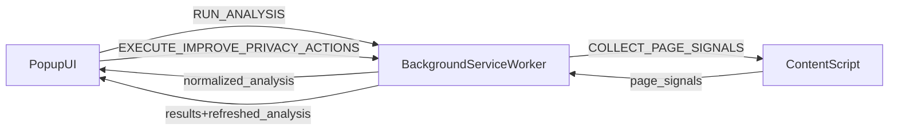

## Privacy Assistant

**Understand privacy risk on any page — in seconds.** Privacy Assistant is a local-only **Chrome Extension** that analyzes privacy-related signals on the current site and then guides you through practical “Improve Privacy” actions.

It’s built to feel like a real product: fast feedback, clear reasoning, and a transparent privacy model.

### Why you’d use it

- **Spot tracking exposure quickly**: third‑party scripts, cookies, suspicious endpoints, known tracker domains.
- **Get actionable recommendations**: not just “this is risky”, but “here’s what to do next”.
- **Stay in control**: actions run only when you click, are executed sequentially, and report `success` / `failed` / `skipped`.

### What it is (and isn’t)

- **Local-only**: runs entirely in your browser. No backend, no accounts, no analytics.
- **Signal-based**: relies on heuristics and metadata. It does **not** inspect request bodies.
- **MVP scope**: privacy *signals* + guidance (and limited automatic cleanup where Chrome allows it).

### Highlights

- **Instant scan of the current page** (popup opens → analysis runs automatically)
- **Score + confidence label** so you know whether the result is based on complete signals
- **Risk list with evidence** (sample script domains, top third‑party hosts, suspicious endpoint patterns)
- **Recommendations you can actually act on** (checkboxes + clear rationale)
- **Safe-by-default actions**: only run when you click; sequential execution; per-action results

---

## Quick start (run locally from GitHub)

### Requirements

- Node.js (modern LTS recommended)
- pnpm (this repo uses `corepack` + pnpm workspace)
- Google Chrome (Manifest V3 support)

### Install dependencies

From repo root:

```bash
corepack pnpm install
```

### Load the extension (unpacked)

1. Open `chrome://extensions`
2. Enable **Developer mode** (top-right)
3. Click **Load unpacked**
4. Select the folder: `apps/extension`
5. Pin the extension (optional): toolbar → puzzle icon → pin “Privacy Assistant”

### How to use (typical flow)

1. Open any `http://` or `https://` page.
2. Click the Privacy Assistant icon to open the popup.
3. Review:
   - a **privacy score** and a **confidence label** (high/medium/low)
   - **risks** (with optional evidence/details)
   - **recommendations** (checkboxes)
4. Select one or more recommendations and click **Improve Privacy**.
5. You’ll get per-action results and the extension re-runs analysis.

### Suggested pages to test on

- A simple marketing site (usually “cleaner”)
- A news site (often heavy third‑party scripts)
- A site with ads/analytics dashboards (often triggers tracker heuristics)

---

## Trust & privacy model (how data is handled)

### Data handling guarantees

- **No data leaves your machine**.
- Analysis results exist in-memory while the popup is open.
- The popup stores a small amount of local UI state in **extension localStorage** (e.g. “acknowledged” guided actions). This does not write to website localStorage.

### What network data means here

The extension uses `chrome.webRequest.onBeforeRequest` **metadata only**:

- request URL
- initiator (when available)
- request type

It does not read request bodies.

---

## Permissions (what we request and why)

See [apps/extension/manifest.json](apps/extension/manifest.json).

- **`tabs`**: resolve the active tab URL/hostname and open Chrome settings pages (`chrome.tabs.create`).
- **`cookies`**: read and (optionally) remove cookies for the current site.
- **`webRequest`**: observe request metadata to derive network privacy signals.
- **`host_permissions`** (`http://*/*`, `https://*/*`): required to run the content script on pages you visit.

### Security notes

- Popup uses external CSS (`popup.html` loads [apps/extension/popup.css](apps/extension/popup.css)); no inline `<style>` required.
- Extension page CSP is explicitly set in `manifest.json` (`content_security_policy.extension_pages`).
- Background/content message handlers validate message shape and return structured errors on unsupported message types.

---

## Product behavior (what you’ll see)

### Privacy score (0–100)

The popup computes a deterministic score from:

- third‑party script domains
- estimated third‑party cookies
- storage footprint (local + session)
- tracking heuristic indicator count
- network suspiciousness (scaled to a 5s‑equivalent based on observed window)

### Risks

The popup maps signals + thresholds into risk items with:

- `title`, `severity` (`low`/`medium`/`high`), and a user explanation
- optional details (evidence lines like sample domains and top hosts)

### Recommendations

Recommendations are generated by mapping risk IDs → action IDs, then shown as checkboxes.

### How to interpret results

- **Score bands** (rough guidance):
  - **80–100**: relatively low tracking exposure compared to common patterns
  - **60–79**: moderate exposure; you’ll usually see meaningful hardening opportunities
  - **0–59**: higher exposure signals detected (many third parties, tracker-like endpoints, etc.)
- **Confidence label**:
  - **High**: content signals + cookie signals + network signals were available
  - **Medium**: some signals were missing (often network signals), but analysis is still useful
  - **Low**: core signals were unavailable (for example on restricted pages); treat results as incomplete

---

## “Improve Privacy” actions (how it behaves)

### Action IDs

Action IDs are stable strings like:

- `reduce_third_party_cookies`
- `clear_site_storage_data`
- `block_known_trackers`
- `review_tracking_permissions`
- `harden_network_privacy`
- `limit_third_party_scripts`

### Execution model

- Actions run **sequentially** to keep behavior predictable.
- Failures do not stop the queue; you get per-action results: `success` / `failed` / `skipped`.
- After actions complete, the background re-runs analysis and the popup refreshes.

### Limitations (important)

Chrome limits what extensions can do automatically, especially around storage and site settings. Some actions therefore:

- remove cookies where permitted
- open relevant Chrome settings pages for guided manual steps

---

## Architecture overview (runtime)

High-level flow:



### What Chrome actually loads

`manifest.json` points to runtime entrypoints inside `apps/extension/`:

- `background.js` (service worker module)
- `content.js` (content script)
- `popup.html` + `popup.js` + `popup.css` (popup UI)
- `messages.js` (shared constants/helpers for popup/background)

### Workspace layout

- **`apps/extension/`**: unpacked Chrome extension (what users load).
  - The runtime is implemented in plain JavaScript files in `apps/extension/` (as referenced by the manifest).

---

## What the extension collects (signals)

### Content script signals (`apps/extension/content.js`)

Collected from the page DOM and browser APIs available in content scripts:

- **Script signals**
  - counts `script[src]`
  - detects third‑party script domains (relative to the current site)
  - returns a sample list of external scripts
- **Storage signals**
  - estimates size of localStorage/sessionStorage by key/value length
- **Tracking heuristics**
  - known tracker-domain patterns (e.g. GA, DoubleClick, GTM, FB, etc.)
  - suspicious endpoint substrings (`collect`, `track`, `pixel`, `beacon`, `events`)
  - tracking query params in the page URL (e.g. `utm_`, `fbclid`, `gclid`, etc.)

### Background signals (`apps/extension/background.js`)

- **Cookie signals**
  - reads cookies for the current site via `chrome.cookies.getAll({ url })`
  - estimates third‑party cookie presence by sampling top observed third‑party request hosts and querying cookie state for those hosts (heuristic)
- **Network request signals**
  - buffers recent webRequest metadata per tab for the last ~60s
  - derives:
    - third-party request count
    - suspicious endpoint hit counts
    - known tracker-domain matches
    - a short-window “burst” metric

---

## Development (scripts + quality gates)

From repo root:

```bash
corepack pnpm lint
corepack pnpm typecheck
corepack pnpm test
```

- **lint**: ESLint across workspace (`eslint.config.js`)
- **typecheck**: TypeScript configuration/type checks (note: the shipped extension runtime is JavaScript)
- **test**: currently a placeholder for the extension app (see `apps/extension/package.json`)

### Current test state

This repo currently does not ship automated extension tests. If you want a strict “release gate”, use:

- `pnpm lint`
- `pnpm typecheck`
- a manual smoke run (load unpacked → run analysis → run Improve Privacy once)

---

## Troubleshooting

- **Popup says “No supported active tab found”**:
  - You’re on a restricted page (`chrome://`, Chrome Web Store) or no active HTTP(S) tab exists.
  - Open a normal `https://` webpage and try again.

- **Content script unreachable**:
  - Reload the page.
  - Reload the extension from `chrome://extensions`.

- **Network signals unavailable**:
  - Some Chrome environments restrict `webRequest` collection; the extension degrades confidence and continues.

---

## FAQ

### Why does “third-party cookies” sometimes show 0?

Browsers don’t expose a perfect “third-party cookies for this page” number. This extension uses a **best-effort heuristic** (based on the page’s observed third-party network hosts and cookie state), so a 0 can mean:

- the page didn’t contact third-party hosts recently (within the observed window), or
- those hosts didn’t have cookies set in your browser, or
- network signals were unavailable (restricted environment).

### Is the score guaranteed to be accurate?

No—this is a privacy signal analyzer. It’s designed to be **directionally useful and explainable**, not a definitive measurement tool. Treat it as a fast “risk radar” and use the evidence details to decide what to do next.

---

## Roadmap (suggested next steps)

- Make results more explainable (per-factor breakdown + stronger evidence snapshots)
- Add a short “privacy timeline” view from the last 60s of network signals
- Add a proper license (`LICENSE`) before publishing publicly on GitHub