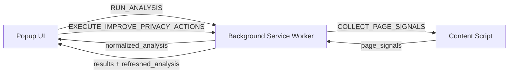

# 🛡️ Privacy Assistant

> **Understand privacy risk on any page in seconds.**

Privacy Assistant is a **local-only Chrome Extension** that analyzes privacy signals on the current site and guides you through practical hardening actions. Built to feel like a real product: fast feedback, clear reasoning, and a transparent privacy model.


---

## ✨ Why Privacy Assistant?

| ✅ What it does | ❌ What it doesn't |
|---|---|
| Spots trackers, third-party scripts & suspicious endpoints | Send any data to a server |
| Gives actionable next steps, not just warnings | Require an account or sign-in |
| Runs actions only when you click, with per-action results | Inspect request bodies |
| Scores your exposure with a confidence label | Run anything without your approval |

---

## 📸 Screenshots

<table>
  <tr>
    <th>🔍 Risks & Evidence</th>
    <th>💡 Recommendations</th>
    <th>⚙️ Pre-action Confirmation</th>
  </tr>
  <tr>
    <td></td>
    <td></td>
    <td></td>
  </tr>
</table>

---

## 🚀 Quick Start

### Requirements

- **Node.js** — modern LTS recommended
- **pnpm** — this repo uses `corepack` + pnpm workspace
- **Google Chrome** — Manifest V3 support required

### Install

```bash
corepack pnpm install
```

### Load the Extension

1. Open `chrome://extensions`
2. Enable **Developer mode** (toggle, top-right)
3. Click **Load unpacked**
4. Select the `apps/extension` folder
5. *(Optional)* Pin it: toolbar → puzzle icon → pin **Privacy Assistant**

### How to use

1. Open any `http://` or `https://` page
2. Click the **Privacy Assistant** icon to open the popup
3. Review your **privacy score**, **confidence label**, and **risk list**
4. Select one or more recommendations and click **Improve Privacy**
5. View per-action results — the extension re-runs analysis automatically

> 💡 **Good pages to test on:** a simple marketing site (usually clean), a news site (often heavy with third-party scripts), or an ad/analytics dashboard (frequently triggers tracker heuristics).

---

## 📊 Understanding Your Score

The score (0–100) is computed deterministically from third-party scripts, estimated cookies, storage footprint, tracking heuristic indicators, and network suspiciousness.

| Score | Signal |
|---|---|
| 🟢 **80–100** | Relatively low tracking exposure |
| 🟡 **60–79** | Moderate exposure - hardening opportunities likely |
| 🔴 **0–59** | Higher exposure signals detected |

### Confidence Label

| Label | Meaning |
|---|---|
| 🔵 **High** | Content + cookie + network signals all available |
| 🟡 **Medium** | Some signals missing (often network), results still useful |
| ⚪ **Low** | Core signals unavailable (e.g. restricted page), treat as incomplete |

---

## 🔧 "Improve Privacy" Actions

Actions run **sequentially** for predictability. A failure doesn't stop the queue - you get per action `success` / `failed` / `skipped` results. After the queue completes, analysis re-runs automatically.

```
reduce_third_party_cookies     clear_site_storage_data
block_known_trackers           review_tracking_permissions
harden_network_privacy         limit_third_party_scripts
```

> ⚠️ **Chrome limits what extensions can automate.** Some actions remove cookies directly, others open the relevant Chrome settings page for guided manual steps.

---

## 🏗️ Architecture



### Runtime Entrypoints (`apps/extension/`)

| File | Role |
|---|---|
| `background.js` | Service worker — orchestrates analysis and actions |
| `content.js` | Content script — collects DOM and storage signals |
| `popup.html / popup.js / popup.css` | Extension popup UI |
| `messages.js` | Shared message constants and helpers |

---

## 🔬 Signals Collected

### Content Script (`content.js`)
- **Scripts** - counts and third-party domain detection; sample list of external scripts
- **Storage** - localStorage/sessionStorage size estimates
- **Tracking heuristics** - known tracker domains (GA, DoubleClick, GTM, FB, etc.), suspicious endpoint substrings (`collect`, `track`, `pixel`, `beacon`, `events`), tracking query params (`utm_`, `fbclid`, `gclid`, etc.)

### Background (`background.js`)
- **Cookies** - reads first-party cookies via `chrome.cookies.getAll`; estimates third-party presence by sampling top observed third-party hosts
- **Network requests** - buffers `webRequest` metadata per tab for the last ~60s; derives third-party request count, suspicious endpoint hits, tracker-domain matches, and a short-window burst metric

---

## 🔒 Privacy & Data Handling

- 🚫 **No data leaves your machine.** No backend, no accounts, no analytics.
- 🧠 Analysis results exist in memory while the popup is open.
- 💾 A small amount of UI state is persisted in **extension localStorage** (e.g. acknowledged guided actions) - separate from website localStorage and never shared.
- 👁️ The extension uses `chrome.webRequest` for **request metadata only** (URL, initiator, type). Request bodies are never read.

---

## 🔑 Permissions

| Permission | Why it's needed |
|---|---|
| `tabs` | Resolve the active tab URL and open Chrome settings pages |
| `cookies` | Read and optionally remove cookies for the current site |
| `webRequest` | Observe request metadata for network privacy signals |
| `host_permissions` | Run the content script on `http://` and `https://` pages you visit |

---

## 🛠️ Troubleshooting

**"No supported active tab found"**
You're on a restricted page (`chrome://`, Chrome Web Store) or there's no active HTTP(S) tab. Open a normal `https://` page and try again.

**"Content script unreachable"**
Reload the page, then reload the extension from `chrome://extensions`.

**Network signals unavailable**
Some Chrome environments restrict `webRequest` collection. The extension degrades gracefully to a lower confidence label and continues.