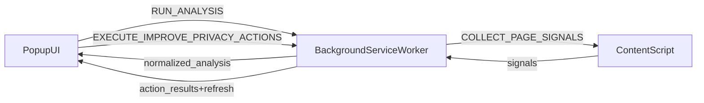

## Privacy Assistant (Phase 1 MVP)

Privacy Assistant is a **local-only Chrome Extension (Manifest V3)** that analyzes privacy-related signals on the currently active webpage (cookies, third-party scripts, storage usage, tracking heuristics, and network metadata) and then suggests practical “Improve Privacy” actions you can apply.

### What it is (and is not)

- **Local-only**: runs entirely in your browser. No backend, no accounts, no analytics.
- **Signal-based**: relies on heuristics and metadata. It does **not** inspect request bodies.
- **MVP scope**: focuses on privacy *signals* + actionable guidance (and limited automated cleanup where Chrome allows it).

---

## Quick start (run locally from GitHub)

### Requirements

- Node.js (modern LTS recommended)
- pnpm (this repo uses `corepack` + pnpm workspace)
- Google Chrome (Manifest V3 support)

### Install dependencies

From repo root:

```bash
corepack pnpm install
```

### Load the extension (unpacked)

1. Open `chrome://extensions`
2. Enable **Developer mode** (top-right)
3. Click **Load unpacked**
4. Select the folder: `apps/extension`
5. Pin the extension (optional): toolbar → puzzle icon → pin “Privacy Assistant”

### Use it

1. Navigate to any `http://` or `https://` page.
2. Click the Privacy Assistant extension icon to open the popup.
3. The popup runs analysis automatically and shows:
   - privacy score + confidence
   - detected risks
   - recommended actions (checkboxes)
4. Select one or more actions and click **Improve Privacy**.
5. The extension executes the selected actions sequentially and then re-runs analysis.

---

## Permissions (what we request and why)

See [apps/extension/manifest.json](apps/extension/manifest.json).

- **`tabs`**: read the active tab URL/hostname and open Chrome settings pages (`chrome.tabs.create`).
- **`cookies`**: read and (optionally) remove cookies for the current site.
- **`webRequest`**: observe **request metadata only** (URL, initiator, type) to derive network privacy signals. No request bodies are inspected.
- **`host_permissions`** (`http://*/*`, `https://*/*`): required to inject and run the content script on pages you visit.

### Security notes

- The popup uses a dedicated stylesheet ([apps/extension/popup.css](apps/extension/popup.css)) to avoid inline-style reliance.
- Extension page CSP is explicitly set in the manifest (`content_security_policy.extension_pages`).
- Background/content message handlers validate message shape and return structured errors on unsupported message types.

---

## Privacy model (data handling)

- **No data leaves your machine**.
- Analysis results exist in-memory while the popup is open.
- Optional local UI state is stored in the extension context (not on websites).
- Network analysis uses **`chrome.webRequest.onBeforeRequest` metadata** only:
  - request URL
  - initiator (if available)
  - request type

---

## Architecture overview

High-level flow (Phase 1):



### Key folders

- **`apps/extension/`**: the unpacked Chrome extension (what Chrome loads).
  - Runtime entrypoints used by `manifest.json`:
    - `background.js` (service worker, module)
    - `content.js` (content script)
    - `popup.html` + `popup.js` + `popup.css` (popup UI)
    - `messages.js` (shared runtime utilities/constants for popup/background)
  - **`apps/extension/src/**`**: TypeScript reference modules (typechecked + linted). These are useful for development and future consolidation, but **the current manifest loads the JS files in `apps/extension/`**.
- **`packages/shared/`**: shared TypeScript “engine” logic (score/risk/recommendations) with unit tests.

---

## Runtime message/data flow (what talks to what)

### Message types

Defined in [apps/extension/messages.js](apps/extension/messages.js):

- `PING` (popup → background): quick health check
- `RUN_ANALYSIS` (popup → background): runs analysis pipeline and returns normalized signals
- `PING_CONTENT` (background → content): confirm content script reachability
- `COLLECT_PAGE_SIGNALS` (background → content): collect in-page signals (scripts/storage/page context)
- `EXECUTE_IMPROVE_PRIVACY_ACTIONS` (popup → background): execute selected action IDs, then refresh analysis

### Data produced (normalized analysis)

The background builds a normalized payload in [apps/extension/background.js](apps/extension/background.js) (see `buildNormalizedAnalysis(...)`). It merges:

- **content signals** (from `content.js`):
  - script domains + counts
  - localStorage/sessionStorage size signals
  - tracking heuristics (known tracker domains, suspicious endpoints, tracking query params)
- **cookie signals** (from `chrome.cookies`)
- **network signals** (from `chrome.webRequest` metadata, if available)

If a collector is unavailable or a page is unsupported (e.g. `chrome://`), the analysis still returns a structured response with **reduced confidence** and explicit warnings.

---

## Scoring, risks, and recommendations

There are two layers in this repo:

### 1) Shared “engine” (TypeScript, test-covered)

Located in `packages/shared/src/`:

- **Score**: [packages/shared/src/scoring/privacyScore.ts](packages/shared/src/scoring/privacyScore.ts)
- **Risks**: [packages/shared/src/risks/detectRisks.ts](packages/shared/src/risks/detectRisks.ts)
- **Recommendations**: [packages/shared/src/recommendations/generateRecommendations.ts](packages/shared/src/recommendations/generateRecommendations.ts)
- **Confidence**: [packages/shared/src/confidence/deriveConfidence.ts](packages/shared/src/confidence/deriveConfidence.ts)

This package has unit tests:

- [packages/shared/tests/scoringRisksRecommendations.test.ts](packages/shared/tests/scoringRisksRecommendations.test.ts)
- [packages/shared/tests/confidence.test.ts](packages/shared/tests/confidence.test.ts)

### 2) Current popup runtime mapping (JS)

The currently shipped popup UI (`apps/extension/popup.js`) derives a view-model from normalized analysis and builds user-facing risks/recommendations and actions.

For Phase 1, the goal is to keep the runtime behavior reliable, transparent, and deterministic. Future work can consolidate runtime scoring/risk/recommendation logic to use the shared engine via a build step.

---

## “Improve Privacy” actions (how they work)

### Action IDs

The core action IDs are represented as strings (e.g. `reduce_third_party_cookies`, `harden_network_privacy`). They appear in:

- Popup UI: checkbox values in `apps/extension/popup.js`
- Background execution routing: `apps/extension/background.js` (`executeImproveAction(...)`)

### Execution model

- Actions run **sequentially** to keep behavior predictable.
- If one action fails, the queue continues and returns per-action status:
  - `success` / `failed` / `skipped`
- After actions complete, the background re-runs analysis and the popup refreshes.

### What actions can (and can’t) do

Chrome limits what extensions can change automatically. In this MVP:

- Cookie cleanup is **partially automated** (where permitted via `chrome.cookies.remove`).
- Some actions open relevant Chrome settings pages and provide guided steps.
- Some storage cleanup (beyond cookies) may require manual steps and is surfaced as guidance.

---

## How to extend safely (recommendations + actions)

### Add a new recommendation/action (high-level checklist)

1. **Define or choose an action ID** (string).
2. **Add a risk rule** (if needed) in the shared engine:
   - [packages/shared/src/risks/detectRisks.ts](packages/shared/src/risks/detectRisks.ts)
3. **Map risk → recommendation** (if using the shared engine):
   - [packages/shared/src/recommendations/generateRecommendations.ts](packages/shared/src/recommendations/generateRecommendations.ts)
4. **Implement the background action behavior**:
   - [apps/extension/background.js](apps/extension/background.js) (`executeImproveAction(...)`)
5. **Expose it in the popup UI**:
   - [apps/extension/popup.js](apps/extension/popup.js) (render checkbox + rationale)
6. Make the action **idempotent** where possible and always return a clear `success` / `failed` / `skipped` result with a user-readable message.

### Extension safety rules

- Never execute arbitrary page code.
- Never store page content.
- Keep message payloads validated and small.
- Prefer deterministic outputs for the same inputs.

---

## Quality gates (before you share/publish on GitHub)

From repo root:

```bash
corepack pnpm lint
corepack pnpm typecheck
corepack pnpm test
```

- **lint**: ESLint for both `apps/extension` and `packages/shared`
- **typecheck**: TypeScript project reference checks
- **test**: unit tests (currently focused on `packages/shared`)

### Pre-publish checklist (GitHub)

- Run the quality gates above.
- Load the unpacked extension and do a quick smoke run on 1–2 sites.
- Confirm `apps/extension/manifest.json` does not reference missing files.
- Update `manifest.json` version if you want a tagged release.
- Ensure `README.md` and `LICENSE` are present and up to date.

---

## Minimum merge checklist

- `pnpm lint` passes
- `pnpm typecheck` passes
- `pnpm test` passes
- Manual smoke check:
  - Load unpacked extension
  - Open a normal website and confirm analysis renders
  - Select at least one action and confirm results + refresh
  - Confirm behavior on unsupported pages (like `chrome://extensions`) is graceful

---

## Troubleshooting

- **Popup says “No supported active tab found”**:
  - You’re on a restricted page (`chrome://`, Chrome Web Store) or no active HTTP(S) tab exists.
  - Open a normal `https://` webpage and try again.

- **Content script unreachable**:
  - Reload the page.
  - Reload the extension from `chrome://extensions`.

- **Network signals unavailable**:
  - Some Chrome environments restrict `webRequest` collection; the extension degrades confidence and continues.

---

## Project status (Phase 1)

- ✅ MV3 extension with popup + background + content script
- ✅ Normalized analysis with degraded-confidence behavior
- ✅ Improve Privacy action queue with per-action results + refresh
- ✅ Shared scoring/risk/recommendations engine (TypeScript) with tests
- ✅ Repo quality gates: lint/typecheck/test

---

## License

See `LICENSE`.

